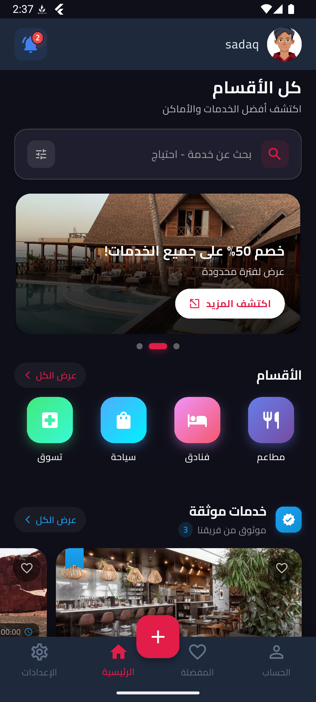
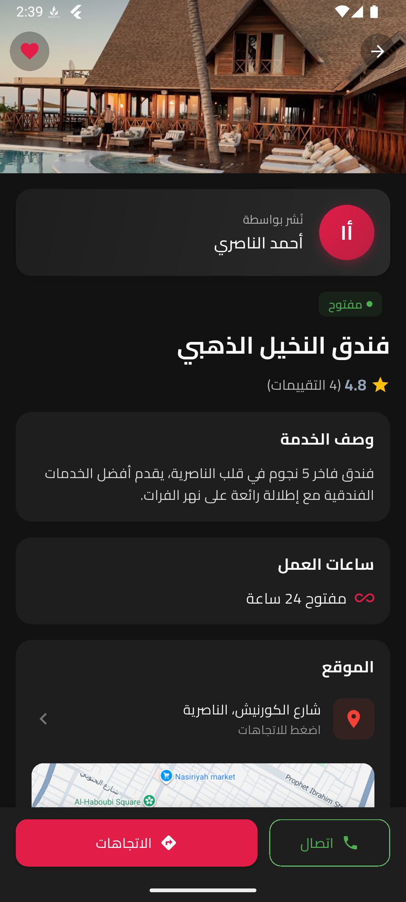
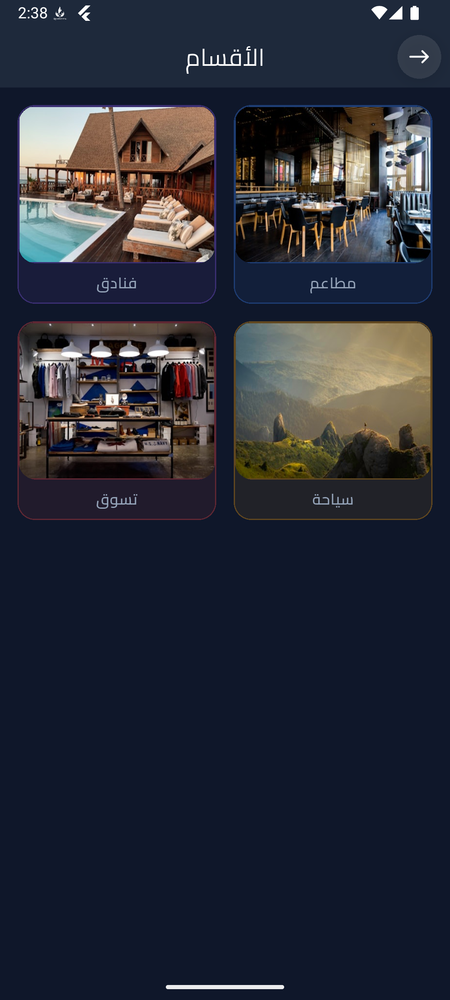
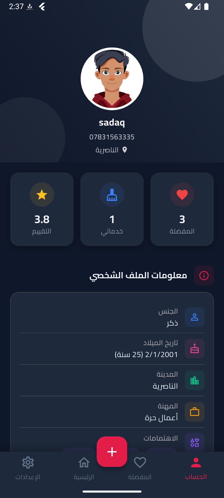
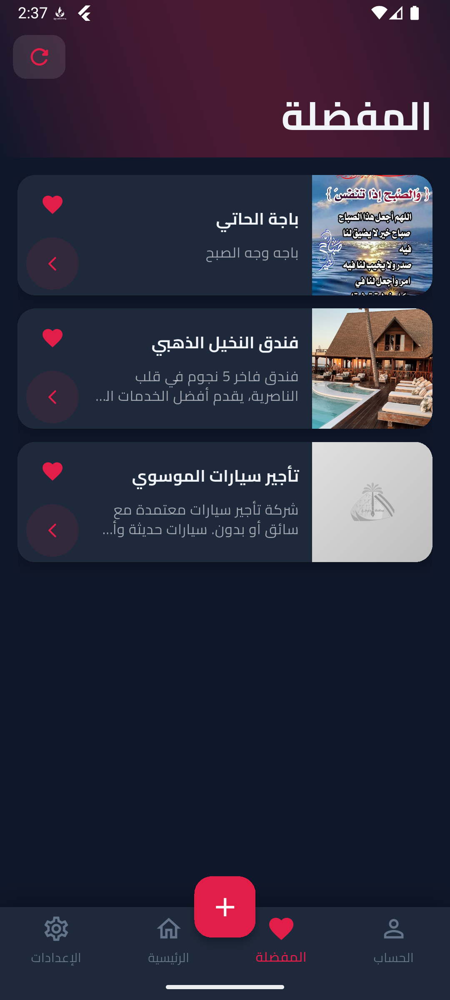
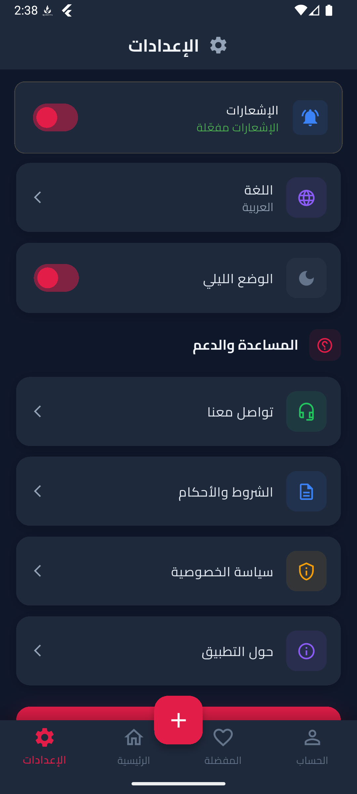

# Daleel Dhi Qar - دليل ذي قار

A local service discovery and review platform for the Dhi Qar governorate in Iraq. Similar to Yelp or TripAdvisor, but specifically designed for local businesses and services in Nasiriyah and surrounding areas.

## Features

### For Users
- **Browse Services** - Explore services organized by categories and subcategories
- **Search & Filter** - Full-text search with location-based filtering
- **Nearby Services** - Find services within your area using GPS (up to 50km radius)
- **Reviews & Ratings** - Community-driven 5-star rating system
- **Favorites** - Save and quickly access your favorite services
- **Offline Support** - Browse cached content without internet connection

### For Service Owners
- **Service Management** - Create, edit, and manage your business listings
- **Image Gallery** - Upload multiple photos for your services
- **Working Hours** - Set operating hours and days
- **Contact Info** - Display phone, WhatsApp, and social media links
- **Location** - Show your business on Google Maps

### App Features
- **Multilingual** - Full Arabic and English support with RTL layout
- **Dark Mode** - Complete dark theme support
- **Push Notifications** - Stay updated with Firebase notifications
- **Real-time Updates** - Live synchronization via Supabase

## Screenshots

<p align="center">
  
  
  
</p>

<p align="center">
  
  
  
</p>

## Tech Stack

- **Framework:** Flutter
- **State Management:** Provider
- **Backend:** Supabase (PostgreSQL, Auth, Storage, Realtime)
- **Push Notifications:** Firebase Cloud Messaging
- **Local Storage:** Hive (offline caching)
- **Maps:** Google Maps Static API

## Getting Started

### Prerequisites

- Flutter SDK (3.0 or higher)
- Dart SDK
- Android Studio / VS Code
- A Supabase account
- A Firebase account

### Installation

1. **Clone the repository**
   ```bash
   git clone https://github.com/yourusername/daleel-dhi-qar.git
   cd daleel-dhi-qar
   ```

2. **Install dependencies**
   ```bash
   flutter pub get
   ```

3. **Configure Supabase**
   - Create a new Supabase project
   - Update the Supabase URL and Anon Key in `lib/core/constants/app_constants.dart`

4. **Configure Firebase**
   - Create a Firebase project
   - Download `google-services.json` (Android) and place it in `android/app/`
   - Download `GoogleService-Info.plist` (iOS) and place it in `ios/Runner/`

5. **Run the app**
   ```bash
   flutter run
   ```

## Project Structure

```
lib/
├── core/
│   ├── constants/       # App constants and configuration
│   ├── helpers/         # Utility functions
│   ├── localization/    # Translations (AR/EN)
│   ├── services/        # API and local services
│   └── theme/           # App theming
├── models/              # Data models
├── providers/           # State management
├── screens/             # UI screens
└── widgets/             # Reusable widgets
```

## Key Providers

| Provider | Description |
|----------|-------------|
| `AuthProvider` | User authentication and session management |
| `ServiceProvider` | Services CRUD operations |
| `CategoryProvider` | Categories management |
| `FavoritesProvider` | User favorites |
| `ReviewProvider` | Reviews and ratings |
| `SearchProvider` | Search functionality |
| `LanguageProvider` | Localization switching |
| `ThemeProvider` | Dark/light theme |

## Offline Support

The app implements an offline-first architecture:
- Categories cached for 24 hours
- Services cached for 30 minutes
- Nearby services cached for 5 minutes
- Reviews cached for 15 minutes
- Operations queued when offline and synced when connection is restored

## Contributing

Contributions are welcome! Please feel free to submit a Pull Request.

## License

This project is licensed under the MIT License - see the [LICENSE](LICENSE) file for details.

## Contact

For questions or support, please open an issue on GitHub.

---

Made with Flutter
